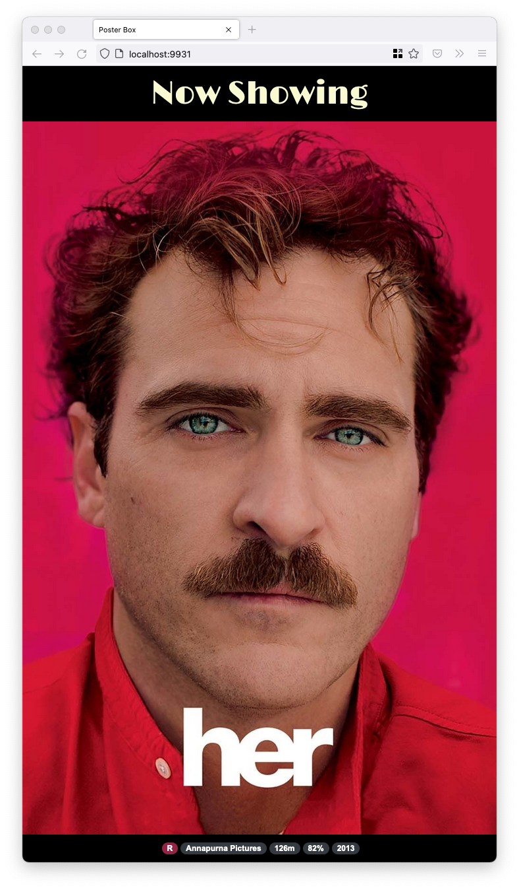
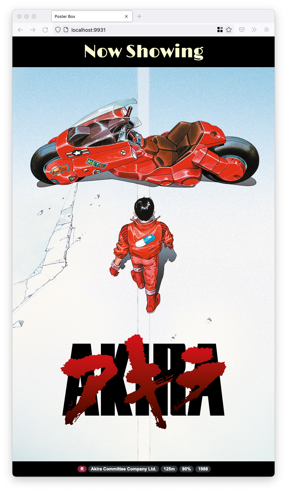
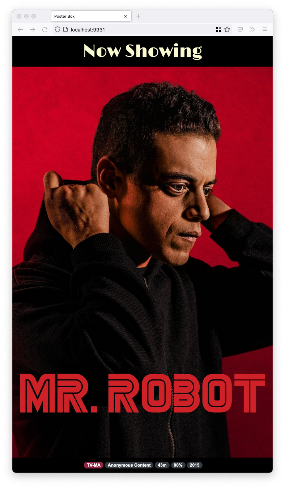

# Poster Box

Rotating display of Plex posters meant for a vertical TV or monitor.

<a href="sample1.png"></a>
<a href="sample2.png"></a>
<a href="sample3.png"></a>

Available as a binary and Docker container.

## Usage

You can run Poster Box in one of two ways:

* [Command line](#command-line)
* [Docker](#docker)

### Command-line

Install on Mac OS with:
```
$ brew install JakeWharton/repo/posterbox
```

For other platforms, download ZIP from
[latest release](https://github.com/JakeWharton/posterbox/releases/latest)
and run `bin/posterbox` or `bin/posterbox.bat`.

```
$ posterbox --help
Usage: posterbox [OPTIONS] CONFIG

  HTTP server for Poster Box frontend

Options:
  --port PORT  Port for the HTTP server (default 9931)
  -h, --help   Show this message and exit

Arguments:
  CONFIG  TOML config file
```


### Docker

The container starts the webserver on port 9931.
It expects to load the [configuration TOML](#configuration) from `/config/config.toml` so mount a volume accordingly.

[][hub]
[][hub]

[hub]: https://hub.docker.com/r/jakewharton/posterbox/

```
$ docker run -it --rm
    -v /path/to/config:/config \
    jakewharton/posterbox
```

#### Docker Compose

```yaml
version: '2'
services:
  posterbox:
    image: jakewharton/posterbox
    restart: unless-stopped
    volumes:
      - /path/to/config:/config
```


### Configuration

The configuration file allows customization of behavior and specifies the source of content.
All top-level keys and sections are optional.
An empty configuration file is technically valid, but will result in no content being displayed.

```toml
# Duration each item is displayed as an ISO 8601 duration string (optional).
# See https://en.wikipedia.org/wiki/ISO_8601#Durations.
#  Value: must be positive duration
#  Default: "PT15S" (15 seconds)
itemDisplayDuration = "PT10S"

# Transition between items (optional).
#  Value: "none", "fade", "crossfade", "slide-right", or "slide-left"
#  Default: "fade"
itemTransition = "slide-right"

# Use Plex as a content source.
#  This section is optional but has required keys if it is present.
[plex]
# Plex host URL (required).
#  Value: String containing DNS hostname or IP with protocol and optional port.
host = "http://plexms:32800"
# Plex authentication token (required).
# See https://support.plex.tv/articles/204059436-finding-an-authentication-token-x-plex-token/.
#  Value: String
token = "abc123"
# Libraries from which to pull posters (optional). No matter the contents of this array,
# only entries of type "movie" or "show" will be used.
#  Value: Array of case-sensitive library names or null to use all available libraries.
#  Default: null
libraries = [ "Movies", "TV Shows" ]
# Minimum rating cut-off for poster inclusion (optional). Content with no rating is
# treated as having a rating of 0. Audience rating takes precedence over critic rating.
#  Value: Whole number in the range [0, 100]
#  Default: 0
minimumRating = 40
# Duration between synchronizing items from Plex server as an ISO 8601 duration
# string (optional). See https://en.wikipedia.org/wiki/ISO_8601#Durations.
#  Value: String containing positive duration
#  Default: "PT15M" (15 minutes)
syncIntervalDuration = "PT30M"
```


## Development

To run the latest code build with `./gradlew installDist`.  This will put the application into
`build/install/posterbox/`. From there you can use the [command-line instructions](#command-line)
to run.

The Docker container can be built with `docker build .`.


## Posterr

Poster Box was inspired by [Posterr](https://github.com/petersem/posterr) which is a far more
feature-filled and customizable tool. Posterr was not able to run smoothly on my Raspberry Pi Zero
due to its use of a jQuery-based carousel and creating DOM nodes for every poster when loaded.
Poster Box has only two sets of DOM elements which are updated when off-screen and animated using
CSS animations. If you like Poster Box but wish it had more features and integrated with more
tools you should try Posterr!


## License

    Copyright 2022 Jake Wharton

    Licensed under the Apache License, Version 2.0 (the "License");
    you may not use this file except in compliance with the License.
    You may obtain a copy of the License at

       http://www.apache.org/licenses/LICENSE-2.0

    Unless required by applicable law or agreed to in writing, software
    distributed under the License is distributed on an "AS IS" BASIS,
    WITHOUT WARRANTIES OR CONDITIONS OF ANY KIND, either express or implied.
    See the License for the specific language governing permissions and
    limitations under the License.
